# Kubernetes Volumes

Container filesystems are temporary. Kubernetes volumes let containers share files or keep data beyond a container's lifetime.

The examples in [`01-kubernetes-volumes/`](01-kubernetes-volumes/) cover `emptyDir`, `hostPath`, persistent storage, and dynamic provisioning. Screenshots show the examples running on Minikube.

| Type | Data lifetime | Main use |
| --- | --- | --- |
| `emptyDir` | Pod lifetime | Temporary files shared in a Pod |
| `hostPath` | Node lifetime | Node-level tools |
| PV and PVC | Independent of a Pod | Persistent application data |
| StorageClass | Cluster configuration | Create storage on demand |

## `emptyDir`

An `emptyDir` is created with a Pod and removed when the Pod is deleted. Containers in the same Pod can mount and share it. In [`01-emptydir.yaml`](01-kubernetes-volumes/01-emptydir.yaml), one container writes a log and another reads it. Memory-backed `emptyDir` is also available, but uses the Pod's memory.

Use it for temporary data, not data that must survive Pod replacement.

## `hostPath`

`hostPath` mounts a node directory into a Pod. The example in [`02-hostpath.yaml`](01-kubernetes-volumes/02-hostpath.yaml) mounts `/tmp` read-only. This can suit node agents, but is usually unsuitable for application data: Pods depend on the node, and writable host mounts can create security risks.

## PersistentVolumes and claims

A **PersistentVolume (PV)** represents cluster storage. A **PersistentVolumeClaim (PVC)** requests that storage, and a Pod mounts the claim.

[`03-pv-pvc.yaml`](01-kubernetes-volumes/03-pv-pvc.yaml) creates a 1 Gi PV, a matching PVC, and a consumer Pod. This local demo uses `hostPath`; production environments usually use CSI-backed storage. Its `Retain` policy keeps the storage for manual recovery after the claim is released. `Delete` may remove the backing storage.

Check the binding with:

```sh
kubectl get pv,pvc
kubectl describe pvc pvc-demo
```

Access modes control mounting: `ReadWriteOnce` allows read-write access from one node; `ReadOnlyMany` allows read-only access across nodes; `ReadWriteMany` allows shared read-write access when supported. `ReadWriteOncePod` restricts access to one Pod when supported by the driver.

## StorageClass and dynamic provisioning

A StorageClass describes how storage is created. A PVC that names one can trigger automatic PV creation.

[`04-dynamic-provisioning.yaml`](01-kubernetes-volumes/04-dynamic-provisioning.yaml) requests 500 Mi from Minikube's `standard` StorageClass. The provisioner creates a PV and binds it to the claim. If `storageClassName` is omitted, Kubernetes uses the default class.

StorageClass settings include the provisioner, backend parameters, reclaim policy, expansion support, and binding mode. `WaitForFirstConsumer` delays provisioning until a Pod is scheduled, helping match storage to its location.

## Screenshots

Screenshots are shown in their original numbered order.

1. Persistent data is readable from the mounted volume.

   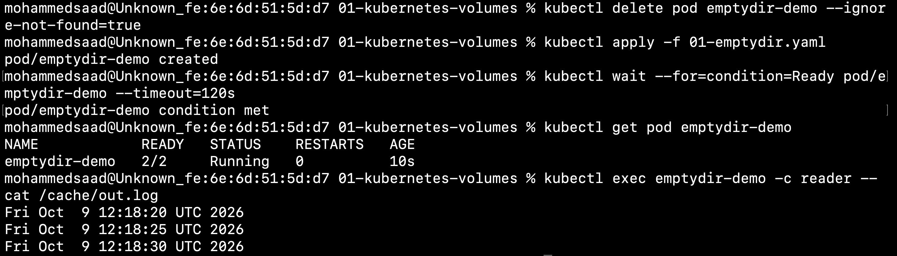

2. The read-only `hostPath` mount blocks writes.

   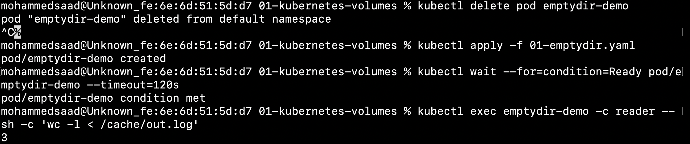

3. PVC deletion and the PV's reclaim behavior are checked.

   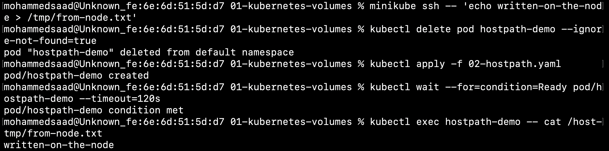

4. Static and dynamically provisioned volumes are listed, and dynamic data is read.

   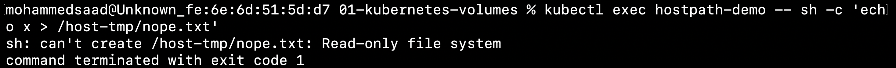

5. A recreated Pod has a fresh `emptyDir`.

   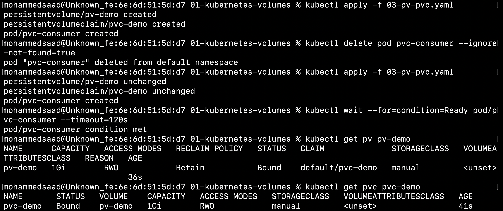

6. The Pod reads a file created on the Minikube node.

   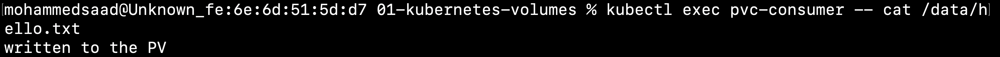

7. Two containers share files through `emptyDir`.

   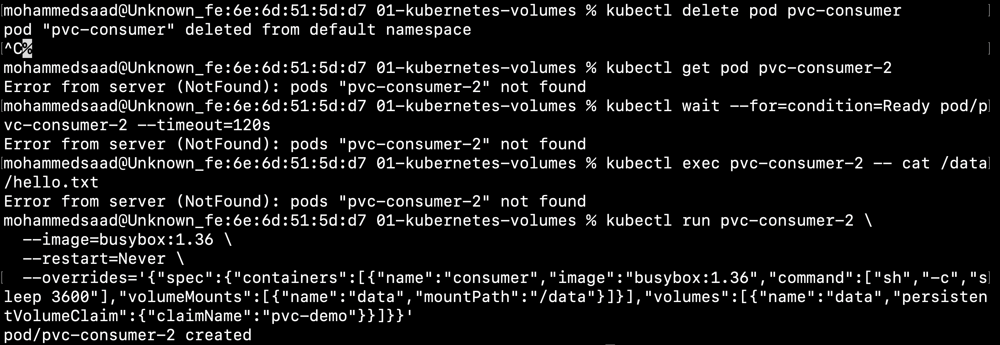

8. PVC consumer Pod recreation is demonstrated.

   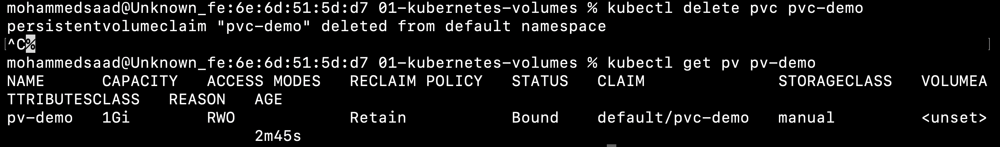

9. Minikube reports successful dynamic volume provisioning.

   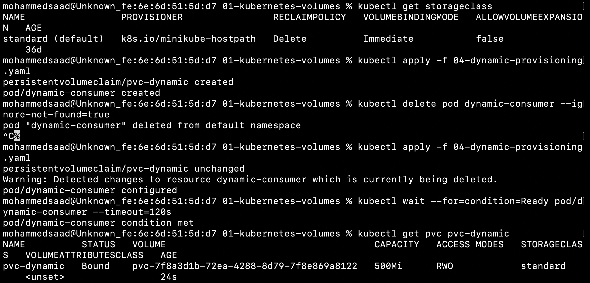

10. The static PV and PVC are created and bound to the consumer Pod.

    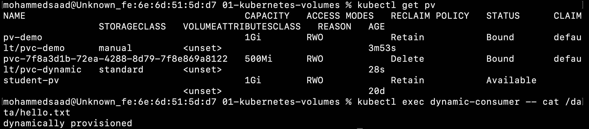

11. The default StorageClass and dynamically bound PVC are shown.

    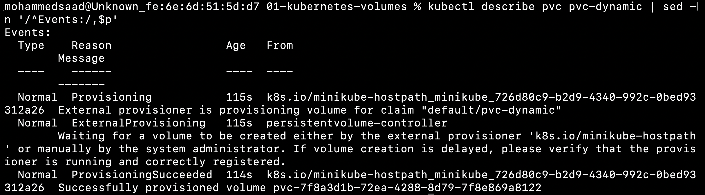

## Run the examples

```sh
cd 13-kubernetes_storage/01-kubernetes-volumes
kubectl apply -f 01-emptydir.yaml
kubectl apply -f 02-hostpath.yaml
kubectl apply -f 03-pv-pvc.yaml
kubectl apply -f 04-dynamic-provisioning.yaml
kubectl get pods,pv,pvc,storageclass
```

The manifests create resources in the default namespace. Apply and remove each demo separately when possible.